# ScanservJS Integration for Home Assistant

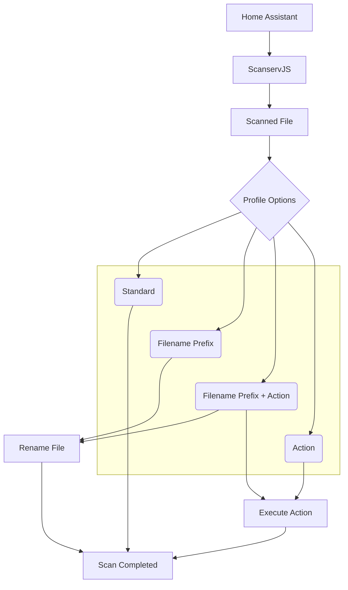

A custom Home Assistant integration to control **ScanservJS** directly from Home Assistant.

Create scan profiles, start scans with one click, automatically rename scanned files and execute custom ScanservJS actions.

---

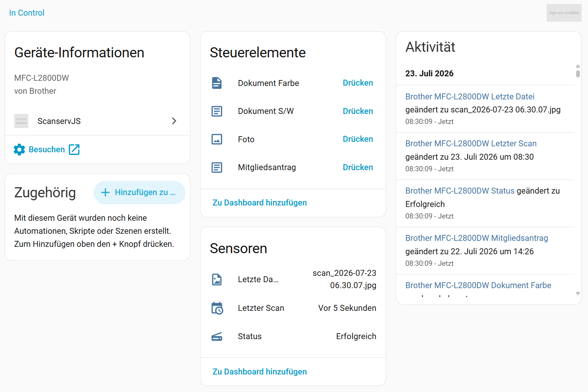

---

## Features

- 📄 Scan documents directly from Home Assistant
- 📑 Support for Flatbed and ADF scanners
- 📚 Multi-page PDF scanning
- 📦 Batch Mode support
- 🎨 Color, Gray and Lineart scanning
- 📏 Paper size selection
- 🔧 ScanservJS filter support
- 📝 Automatic filename prefix
- 📂 Execute ScanservJS file actions after scanning
- 📊 Home Assistant entities for every scan profile
- ⚡ Easy profile management inside Home Assistant
- 🌍 Multi-language support
- 🔄 Automatic file renaming

---

## Requirements

- Home Assistant
- ScanservJS 3.2 or newer
- Scanner supported by ScanservJS
- Working ScanservJS installation

---

# Installation

Copy the integration into

```
custom_components/scanservjs
```

Restart Home Assistant.

After restarting:
```
Settings
→ Devices & Services
→ Add Integration
→ ScanservJS
```

### HACS (Coming Soon)

Not yet available.


---

# Configuration

Only three settings are required.

| Setting | Description |
|----------|-------------|
| Name | Name of the integration |
| URL | ScanservJS URL |
| Verify SSL | Enable SSL verification |

Example:

```
http://192.168.1.10:8080
```

---

# Creating Scan Profiles

Profiles define how documents are scanned.

Each profile stores:

- Scanner source
- Resolution
- Scan mode
- Paper size
- Pipeline
- Filters
- Batch mode
- Filename prefix
- File action

Example:

<p align="center">
  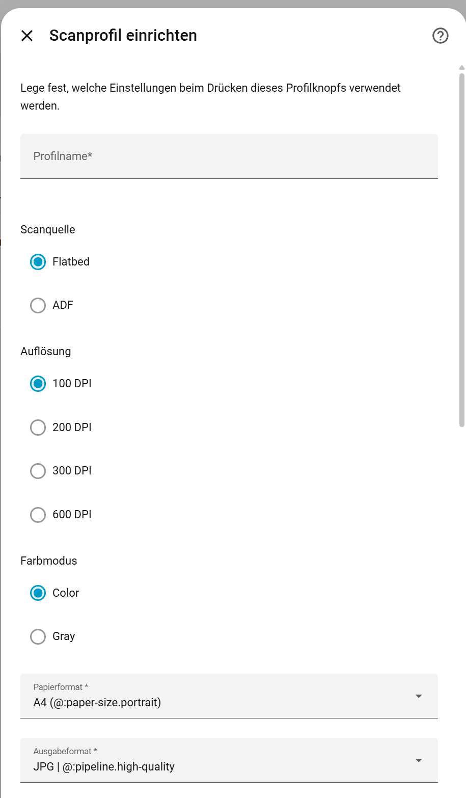
  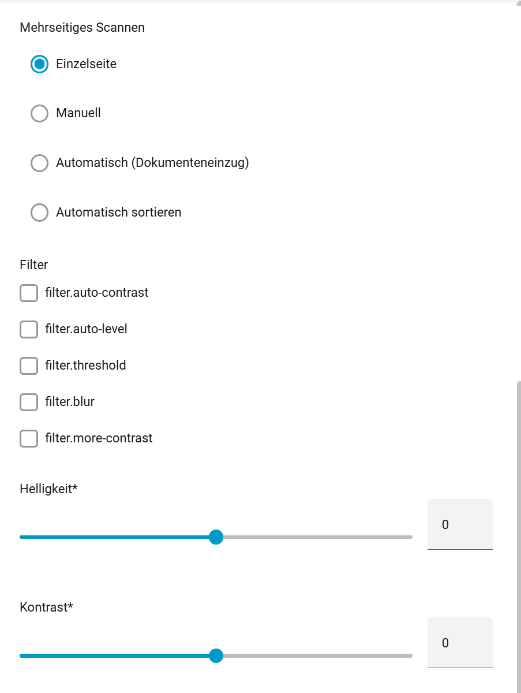
  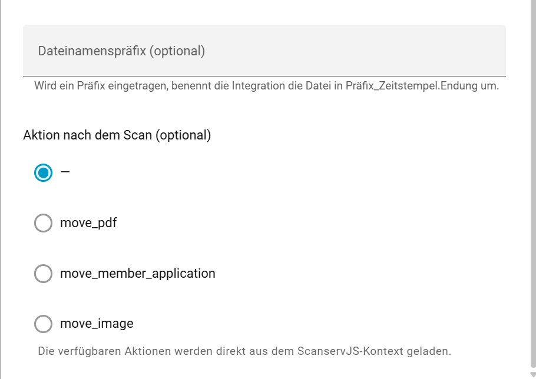
</p>

---

# File Actions

One of the biggest features of this integration is support for **ScanservJS Actions**.

After a scan finishes Home Assistant can execute any configured ScanservJS action.

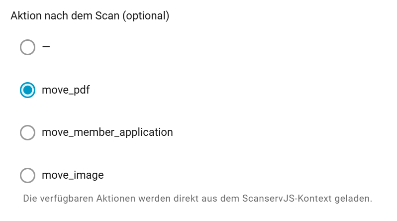

---

## Example Actions

### move_pdf

Moves PDF file into

```
/targets/pdf
```

---

### move_image

Moves images into

```
/targets/image
```

---

### move_member_application

Moves scanned member applications into

```
/targets/pdf/Mitgliedsantraege
```

Example workflow

```
ADF Scan

↓

Mitgliedsantrag_2026-07-23.pdf

↓

move_member_application

↓

/targets/pdf/Mitgliedsantraege
```

---

# Example Action Code in config.local.js

```javascript
  actions: [
    {
      name: "move_pdf",

      /**
       * Verschiebt die angegebene Datei in den PDF-Zielordner.
       *
       * Aufruf über die API:
       * POST /api/v1/files/{filename}/actions/move_pdf
       */
      async execute(fileInfo) {
        const source = fileInfo.fullname;
        const extension = path.extname(source).toLowerCase();

        if (extension !== ".pdf") {
          throw new Error(
            `Die Aktion move_pdf akzeptiert nur PDF-Dateien. Erhalten: ${
              extension || "unbekannter Dateityp"
            }`
          );
        }

        const target = await moveFile(source, PDF_TARGET);

        console.log(
          `[scanservjs] PDF durch Aktion move_pdf verschoben: ${target}`
        );

        return target;
      },
    },

```

You can create your own actions to automatically:

- move files
- rename files
- archive documents
- start external workflows

---

# Dashboard

Every profile creates its own Home Assistant button.

One click starts the complete workflow.

Example

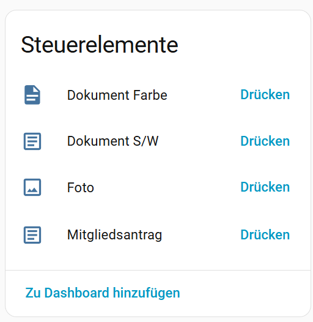

---

# Example Workflow

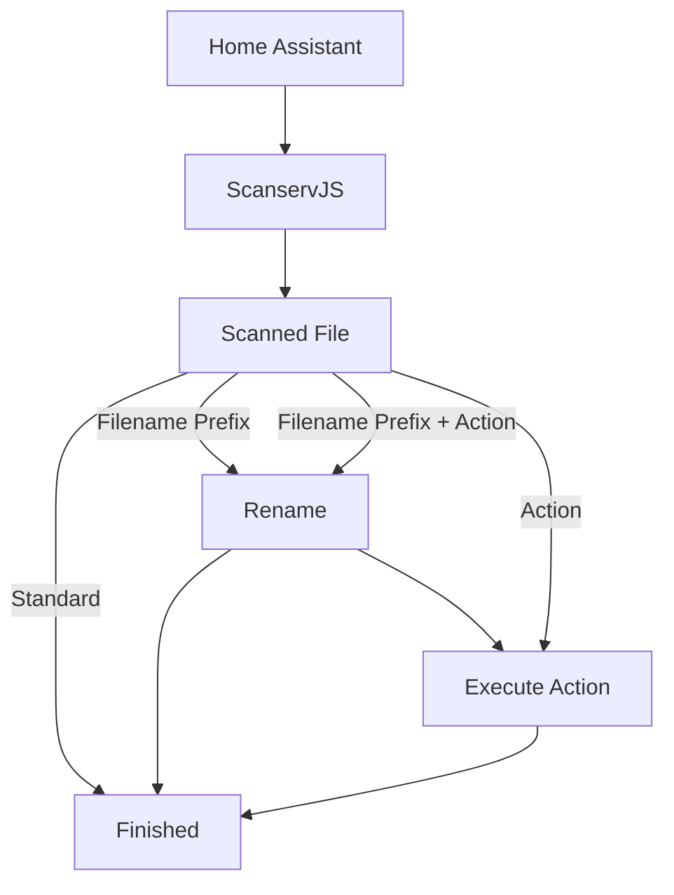

# Troubleshooting

## Scanner not found

Open

```
Settings
→ Devices and Storage
```

Click

```
Reset
```

---

## No Actions available

Verify that your

```
config.local.js
```

contains configured actions.

Restart ScanservJS afterwards.

---

## Rename does not work

This integration uses the ScanservJS rename API.

Current ScanservJS versions expect

```json
{
  "newName": "filename.pdf"
}
```

---

# Screenshots

*(To be added)*

- Dashboard
- Scan Profiles
- Configuration
- Example Actions

---

# Roadmap

Planned features

- HACS support
- Additional scan templates
- More translations
- Improved diagnostics

---

# Contributing

Pull requests are welcome.

If you find a bug, please open an issue.

---

# License

MIT License

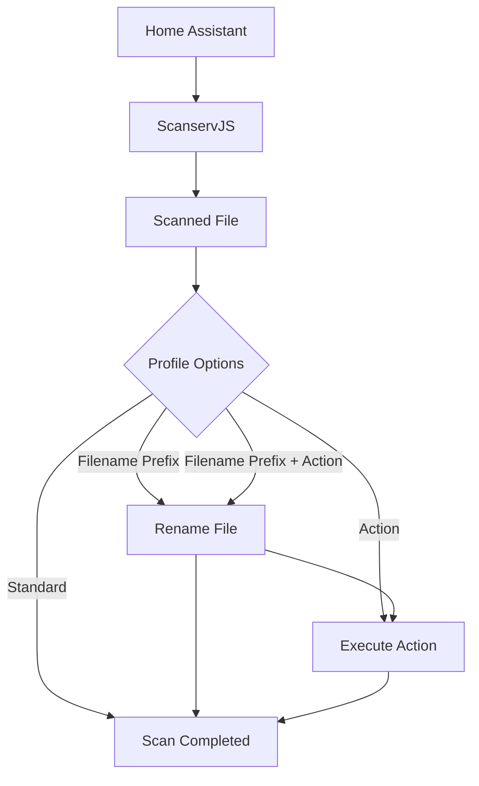

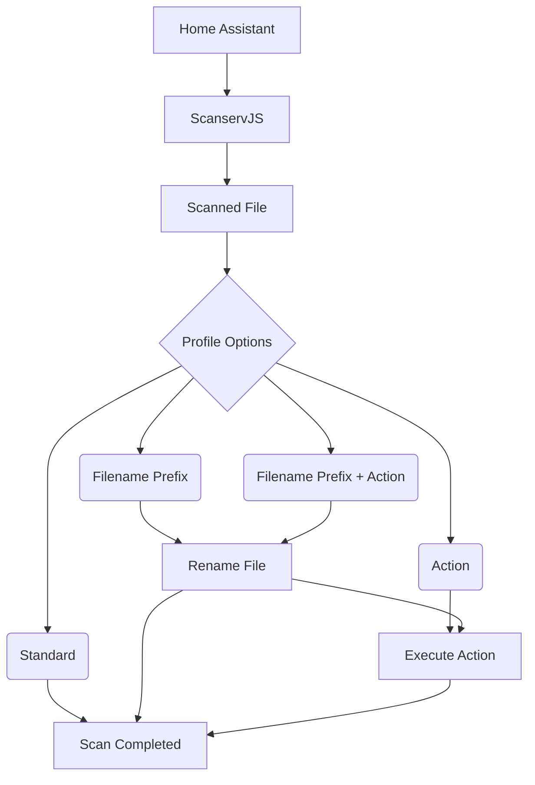

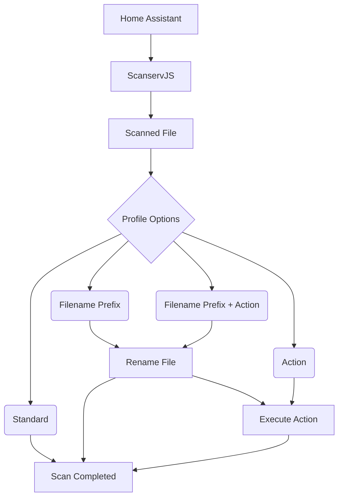


